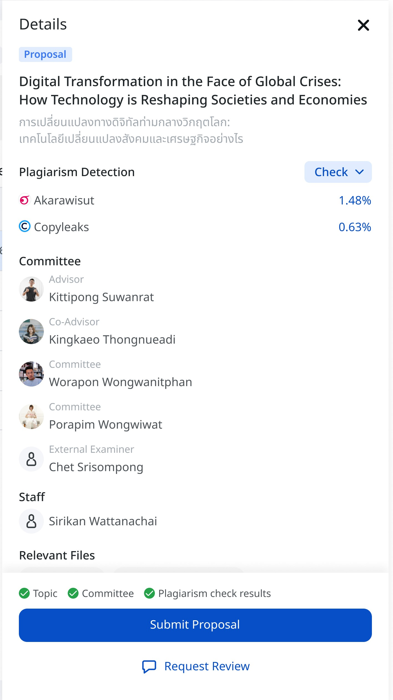

# Revision and Feedback

## Getting to Know the Components of the Revision and Feedback Page

### Thesis Workflow Step Display
- The workflow progress bar (e.g., Proposal → Draft → Complete) helps users understand the current status of their thesis topic and track progress clearly
- The highlighted step indicates your current stage, and you can click to check information from previous steps

### Approvers Section
- Displays the list of people involved and the approval sequence for your thesis as determined by your educational institution

### Thesis Title Section
- Shows your thesis title, which you can edit by clicking the pencil icon according to your institution's procedures

### Revisions Section
A list of revisions or document submissions. Users can check information for each revision as follows:
- **Revision Time**: Date and time when the student submitted the document in that round
- **Plagiarism Check**: Shows the percentage result of the plagiarism check; clicking on the percentage will immediately open the report
- **Relevant Files**: Shows files attached by the student in each round (Word and PDF)
- **Status**: Shows the status of each round, such as pending approval or pending action
- **... (More Options)**: Click to view more details or manage additional options for each round

## Right Details Panel
When you click on your thesis, the system displays details in the right panel:

### Thesis Title
- Displays your thesis title in both English and Thai

### Plagiarism Check Results
- Shows the reviewer and similarity percentage (e.g., 6.39%)

### Committee
Displays the names and positions of committee members involved with your thesis:
- Main advisor
- Co-advisor
- Graduate studies officer

### Relevant Files
Displays the files you've uploaded to the system:
- Word file with file size
- PDF file with file size and number of pages

### Last Modified Date
- Shows the date and time of the latest modification

### Operation Status
Displays various operational statuses, such as:
- Committee review
- Plagiarism check results

## Using Various Functions

### Uploading Revision Files
- Data saved from the iThesis Add-in system or Save to Cloud will appear here
- Read more about Save to Cloud at https://ithesis.zohodesk.com/portal/en/kb/articles/how-to-save-to-cloud-and-download-revision#_Save_to_Cloud

### Submitting a Proposal
1. Make sure you have uploaded all necessary files
2. Check the plagiarism status and committee information
3. Click the "Submit Proposal" button at the bottom of the details panel

### Requesting a Review
If you need additional review from your advisor:
1. Click the "Request Review" link at the bottom of the details panel
2. Fill in the details or questions you want your advisor to check
3. Confirm the request submission

### Tracking Progress
- You can track the progress of your thesis from the status bar at the top (Proposal, Draft, Complete) and from the checkmarks in the details panel

## Usage Tips
1. **Update Documents Regularly**: Always upload the latest version of your document whenever you make changes
2. **Check for Plagiarism**: Pay attention to plagiarism check results to avoid problems later
3. **Communicate with Your Advisor**: Use the "Request Review" function to communicate with your advisor when you have questions
4. **Keep Track of Changes**: Take notes of important changes you make in each version

## Basic Troubleshooting
1. **Cannot Upload Files**: Check the file size and extension; the system only supports Word and PDF files no larger than 10MB
2. **Cannot See the Latest Updates**: Try refreshing the web page or logging out and logging back in
3. **Problems with Proposal Submission**: Verify that you have completed all necessary steps (such as uploading files, checking for plagiarism)

If you still encounter problems using the system, please contact Graduate Student Support.

---

We hope this guide will help you use the Revision and Feedback system efficiently. We wish you success in completing your thesis!
